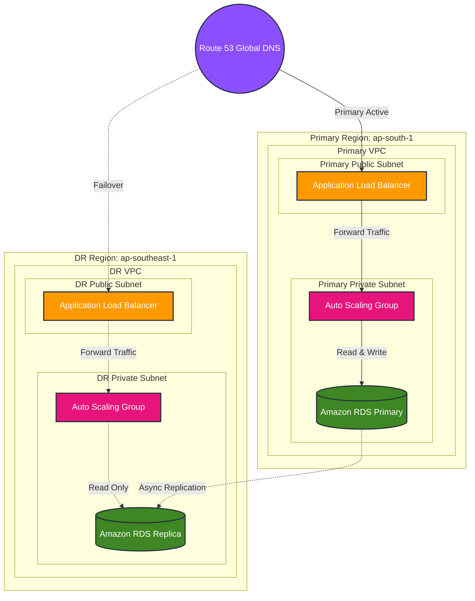

# Multi-Region DR Pipeline Project

This project deploys a complete Multi-Region Disaster Recovery (DR) pipeline on AWS using Terraform.

## Architecture

The infrastructure consists of a Primary Region (Active) and a DR Region (Standby). Traffic is routed via Route 53 Global DNS. State is persisted in an Amazon RDS database with asynchronous Cross-Region Replication to the DR region.




## Project Structure
```text
dr-pipeline/
├── terraform/          # Infrastructure as Code
├── app/                # Flask Health-check & testing App
├── scripts/            # Python & Powershell Scripts for Simulation
└── README.md
```

## Setup & Deployment

1. **Pre-requisites**
   - AWS CLI configured with admin credentials.
   - Terraform installed.
   - Python 3 with `pip install -r requirements.txt`.

2. **Deployment**
   ```bash
   cd terraform
   terraform init
   terraform apply
   ```

## DR Pipeline Simulation

1. **Seed Data (Writes to Primary)**
   ```powershell
   .\seed_data.ps1
   ```
   Or `python seed_data.py`
2. **Check Health (Validates Primary ALB/ASG)**
   ```bash
   python check_health.py
   ```
3. **Verify Replication (Reads from DR Replica)**
   ```bash
   python verify_replication.py
   ```
4. **Simulate Failover (Promotes DR database & Updates Route53)**
   ```bash
   python simulate_failover.py
   ```

## Clean Up
```bash
cd terraform
terraform destroy
```
