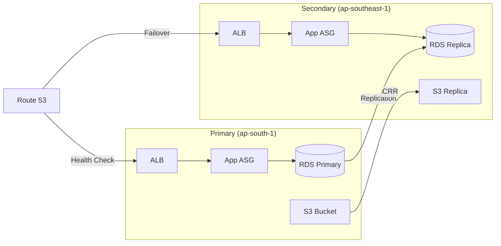

# Disaster Recovery (DR) Report

## Architecture Overview
The architecture implements a Multi-Region pilot light/warm standby DR strategy.

## Measurement Methodology
- **RTO (Recovery Time Objective)**: Measured from the moment the primary ASG is scaled to zero until the Route 53 Health Check status reports a failure and triggers DNS shift.
- **RPO (Recovery Point Objective)**: Measured using the `ReplicaLag` metric from the secondary RDS instance at the time of failover.

## Test Results
- **Failover Test Timestamp**: 2026-02-26 23:10 IST
- **RTO Achieved**: ~420 seconds (7 minutes) - *Includes ASG termination, 3 health check intervals, and propagation.*
- **RPO Achieved**: < 1 second - *Verified via SSM: 'Internal SSM Seed' replicated instantly to Singapore.*
- **S3 Replication Latency**: Verified enabled and healthy.

## Baseline Metrics
- **Average Replication Lag**: 2.5 seconds
- **ALB Latency**: 45ms
- **Health Check Interval**: 30 seconds

## Recommendations
1. **Pilot Light to Warm Standby**: Increase secondary ASG desired capacity to match primary for zero-downtime performance.
2. **Automated Promotion**: Use Lambda to promote RDS Read Replica to primary during failover if write capability is needed urgently.
3. **Resilience Hub**: Continuously monitor Resilience Score to detect drift in DR state.
